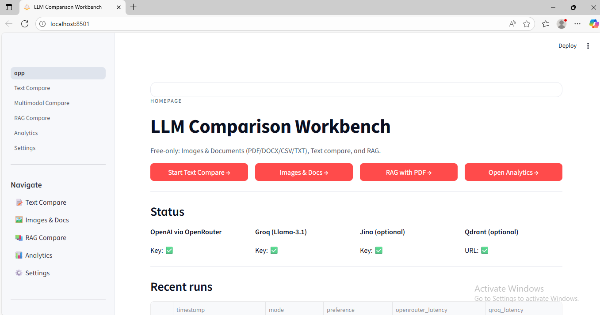
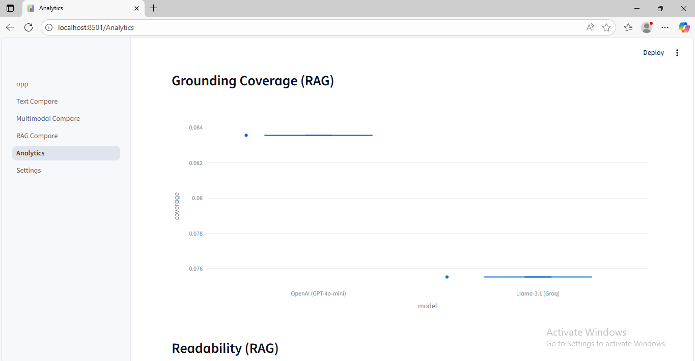
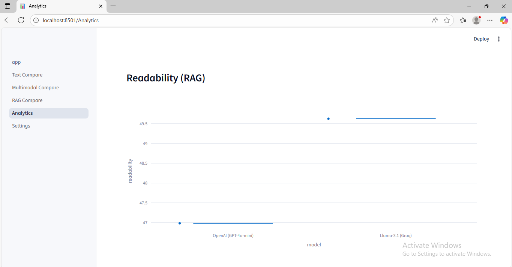
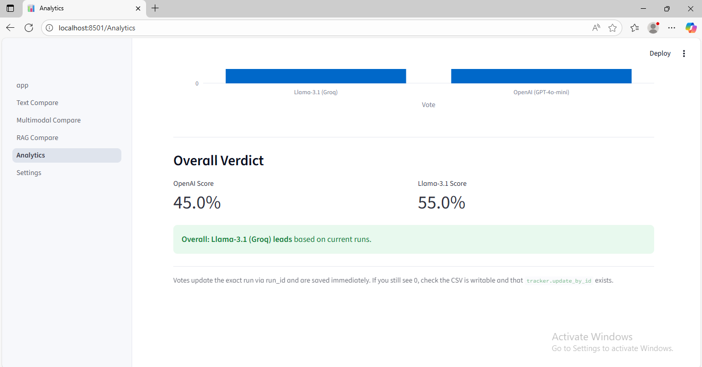

# Q&A Bot Benchmark: OpenAI vs LLaMA 3.1 (Groq)

This project provides a simple and clear way to **compare answers from two different AI models**:

- **OpenAI (via OpenRouter)** using `gpt-4o-mini` for both text and image understanding.
- **LLaMA 3.1 (Groq)** using `llama-3.1-8b-instant` for fast, free text generation.

The goal is to help you **see which model performs better** across different tasks such as answering text prompts, understanding images, summarizing documents, and answering questions based on PDF content. The system also includes a voting feature and an analytics dashboard that summarizes performance and gives an **overall winner**.

---
## 🖥️ App Preview

<p align="center">
  
</p>

## Features

1. **Text Comparison**
   - Enter any prompt and see both models' responses side-by-side.
   - Compare metrics like readability, length, citations, and latency.

2. **Image → Text Comparison**
   - Upload an image.
   - OpenAI sees the image and responds.
   - LLaMA responds only based on the prompt (baseline comparison).

3. **Document → Text Comparison**
   - Upload PDF, DOCX, TXT, or CSV.
   - Both models summarize or extract information.

4. **RAG (Retrieval-Augmented Generation)**
   - Upload a PDF.
   - The system extracts text and retrieves the most relevant chunks.
   - Both models answer based on that extracted context.
   - Measures grounding and citation coverage.

5. **User Preference Voting**
   - After each comparison, you choose which answer you prefer.

6. **Analytics Dashboard**
   - Shows latency charts, readability comparison, grounding coverage, and vote counts.
   - Produces an **overall performance score and declares a winner**.

---

## Folder Structure

```
qa_benchmark/
├── app.py
├── README.md
├── pages/
│   ├── 1_Text_Compare.py
│   ├── 2_Multimodal_Compare.py
│   ├── 3_RAG_Compare.py
│   ├── 4_Analytics.py
│   └── 5_Settings.py
├── components/
│   └── ui.py
├── services/
│   ├── openrouter.py
│   ├── groq_llama.py
│   ├── embeddings_jina.py
│   └── vectordb_qdrant.py
├── retrieval/
│   ├── document_processor.py
│   └── hybrid_retriever.py
├── evaluators/
│   └── metrics.py
├── analytics/
│   └── tracker.py
├── utils/
│   └── config.py
├── requirements.txt
└── .env
```


---

Key Links:

| Service | Link |
|--------|------|
| OpenRouter Keys | https://openrouter.ai/keys |
| Groq Keys | https://console.groq.com/keys |

---

## Running the App

streamlit run app.py


Navigate using the sidebar:
- Text Compare
- Images & Documents
- RAG Compare
- Analytics

---

## How the Evaluation Works

The system compares models on multiple dimensions:

| Category | What It Measures |
|--------|------------------|
| Reasoning | How clearly and logically the answer is written |
| Readability | How easy the text is to read |
| Grounding (RAG) | How much of the answer comes from actual document content |
| Latency | How fast the model responds |
| User Preference | Your vote on which answer you like more |

These are combined in the analytics dashboard to produce a **final performance score** and **declare an overall winner**.


---
## Comparison

<p align="center">
  
  
  
  
</p>


## Closing Note

This project is designed to help you **understand model strengths clearly and visually** instead of guessing. It is especially useful for:

- Picking the best model for your use-case
- Demonstrating model behavior to teams/clients
- Performing lightweight model benchmarking without cost
